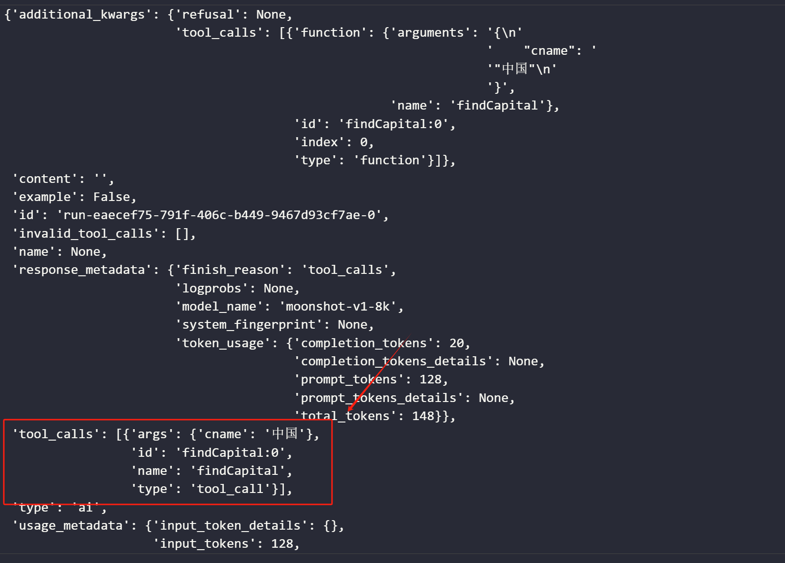

# chatbot
一个简单的chatbot由
- 生成提示词文本的模板
    ```python 
    from langchain.prompts import ChatPromptTemplate
    promot_template = ChatPromptTemplate.from_messages(
    [
        ('system', '你是一个诗人，帮我根据用户的输入写一首现代诗'),
        ('human', '{ipt}')
    ]
    )
    ```
- 预训练模型
  ```python
  from langchain_openai import ChatOpenAI
  apikey = "********"
    model = ChatOpenAI(
        model="moonshot-v1-8k",
        max_tokens=1024,
        api_key=apikey,
        temperature=0.7,
        base_url="https://api.moonshot.cn/v1",
    )
  ```
- 解析模型输出
  ```python
  def out_parser(opt):
    return '##'+opt.__str__()
  ```
三部分组成。其中在第三部分，甚至可用套用其他大模型进行解析。
三个模块之间的联系使用`|`完成。有点管道的味道在了。
```python
chain = promot_template | model | out_parser
ans = chain.invoke(input={'ipt':'夕阳，车流'})
```

# Agent
智能体。下述将描述利用def函数中docs以及duckduckgo搜索引擎来实现RAG。
- 定义model
  ```python
  from langchain_openai import ChatOpenAI
  apikey = "********"
  model = ChatOpenAI(
    model="moonshot-v1-8k",
    max_tokens=1024,
    api_key=apikey,
    temperature=0.7,
    base_url="https://api.moonshot.cn/v1",
  )
  ```
- 导入内置duckduckgo工具和自定义工具装饰器tool，并绑定模型
  ```python
  from langchain_community.tools import DuckDuckGoSearchRun
  from langchain.tools import tool
  tools = [findCapital, DuckDuckGoSearchRun()]
  model_with_tools = model.bind_tools(tools)
  @tool
  def findCapital(cname):
    '''根据国家名查找首都名
    cname为str数据类型，传入cname,获得返回的国家首都信息
    '''
    cname = cname.strip()
    df = pd.DataFrame({
        '国家': ['中国', '美国', '日本'],
        '首都': ['北京', '东京', '华盛顿'],
        })
    return df[df["国家"]==cname]["首都"].values[0].__str__()
  ```
  查看工具调用情况：
  ```python
  from pprint import pprint as pp
  resp = model_with_tools.invoke("中国的首都是哪里, ")
  pp(dict(resp))
  ```
  输出结果：根据函数docs选择了该函数
  
- 将模型与检索后的信息联系起来，构建Agent
  ```python
  def Agent(q:str, model:ChatOpenAI, tools:list[tool]):
    model_with_tools = model.bind_tools(tools)
    model_opt = model_with_tools.invoke(q)   ##返回值记录着需要用到的工具名
    tool_resp  = call_tool(model_opt, tools) 
    final_resp = model.invoke( 
        f'original query:{q}\n\n\n  tool response:{tool_resp}',
    )
    return final_resp

  def call_tool(model_opt, tools):
    tools_map = {tool.name.lower():tool for tool in tools}
    print(tools_map)  
    tools_resp = {}
    for tool in model_opt.tool_calls:
        tool_name = tool['name'].lower()
        tool_args = tool['args']
        tool_instance = tools_map[tool_name]
        tool_resp = tool_instance.invoke(*tool_args.values())
        tools_resp[tool_name] = tool_resp
        print(tool_name, '  ', tool_resp)
    return tools_resp
  ```
  使用Agent
  ```python
  res = Agent("今天深圳天气如何", model, tools)
  print(res.content)
  ```