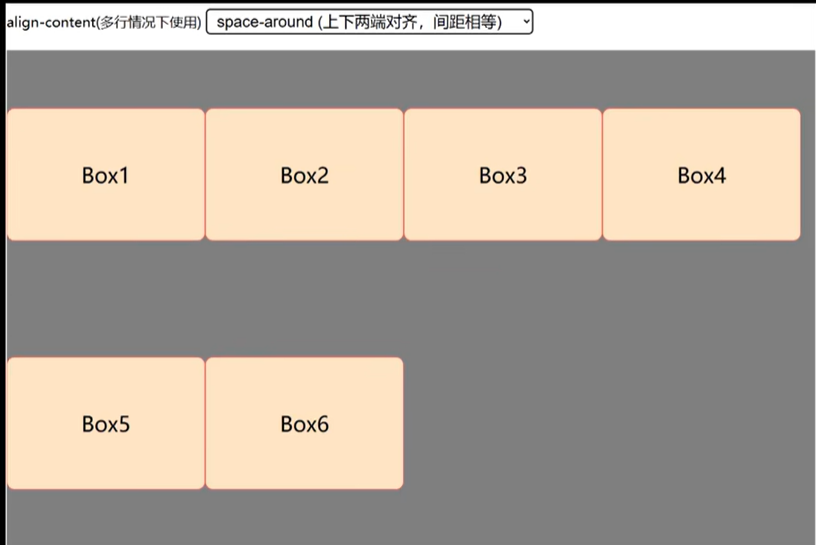
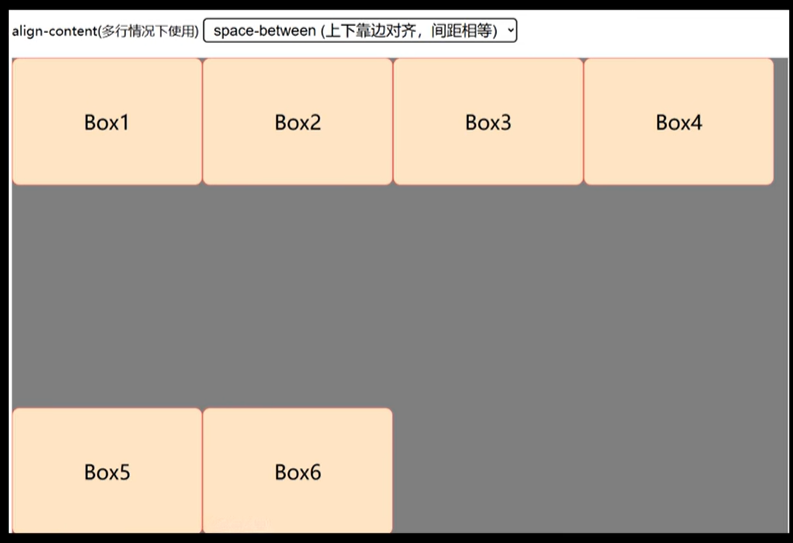
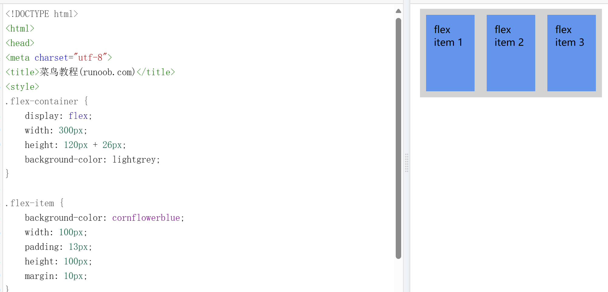

## 正常布局流
浏览器默认的HTML布局方式。例如`
`自动会换行，因为其`display:block`。
`<a>`会与文本的其余内容保持内联（可以看作标签内内容不强制换行），因为其`display:inline`。
> 这些默认的布局方式可以通过修改`display`属性的值来改变

## 弹性盒子`flex`
### 基本信息
1. 一些术语
   - 主轴: main axis,main start, main end
   - 交叉轴: cross axie,cross start, cross end
   - flex容器：设置`display:flex`的父元素
   - flex项目: flex容器中表现为弹性的盒子的元素
> 下为flex容器中的一些设置
2. `flex-direction`
   - 指定主轴的方向
   - 默认值是row
   > `row-reverse`和`column-reverse`用于反向排列flex项
3. `justify-content`
   主轴方向排列方式
   - `flex-start`：从主轴开始位置，从左到右
   - `flex-end`：从主轴结束位置，从右到左
   - `center`：居中
   - `space-between`：最左和最右均靠边，中间均衡分布
   - `space-around`：最左和最右不靠边，中间均衡分布
   > 前三个flex item之间均无间隙
4. `align-items`
   单行交叉轴排列方式
   - `stretch`：默认
   - `flex-start`：在交叉轴起始位置对齐，无间隙
   - `flex-end`：在交叉轴结束位置对齐，无间隙
   - `center`：在交叉轴居中对齐，无间隙
5. `align-content`
   多行交叉轴排列方式
   - `stretch`：默认
   - `flex-start`：在交叉轴起始位置对齐，无间隙
   - `flex-end`：在交叉轴结束位置对齐，无间隙
   - `center`：在交叉轴居中对齐，无间隙  
   - `space-around`：
    
   - `space-between`：
    
    > 不是设置子元素对齐，而是设置行对齐

### flex容器和flex项目的宽度
- flex容器的高度是content区域的高度
- flex项目也是content区域的高度
> $h_{容器} = h_{项目} + 2*padding_{项目} + 2*margin_{项目}$时，能够垂直居中。
> 

### flex-wrap
控制flex项目过多时的换行