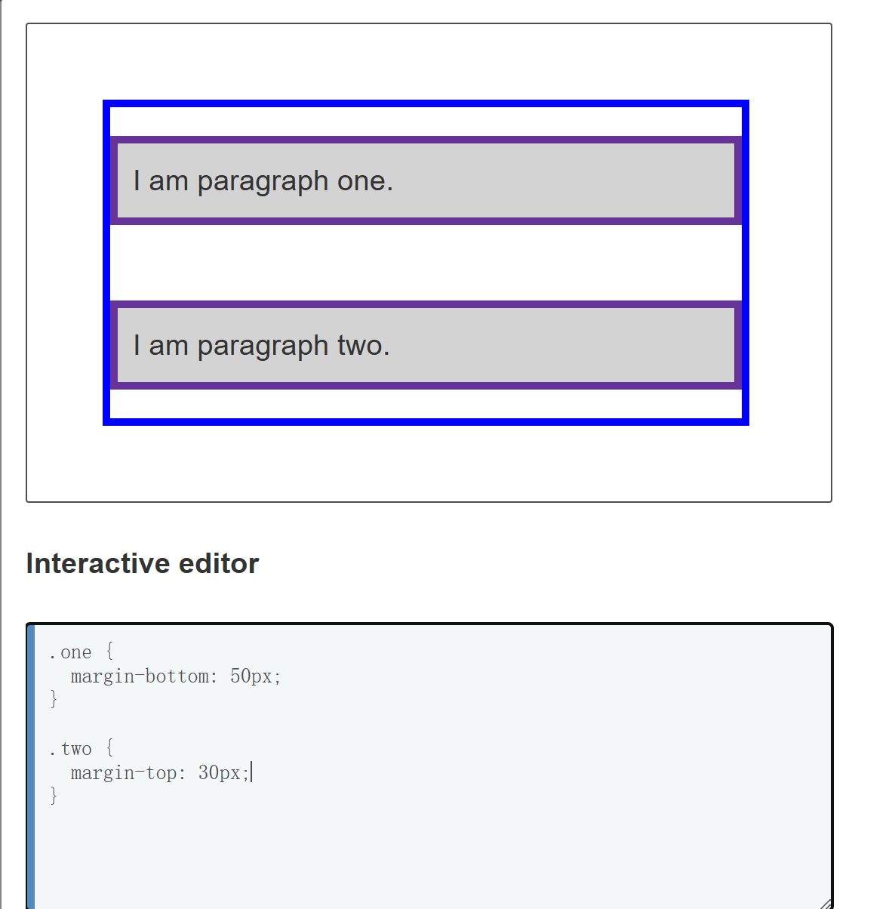
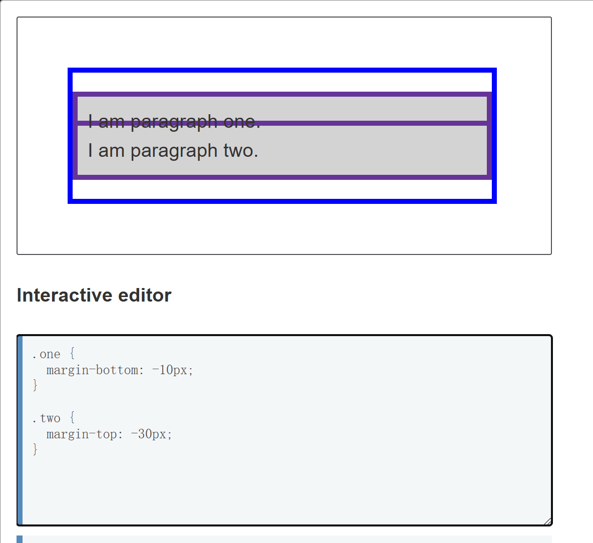
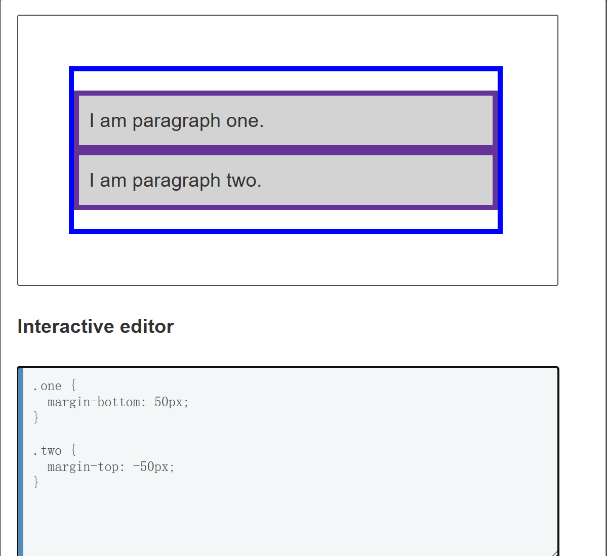

## 盒子的行为方式及不同盒子的关系
- 内部显示:盒子内元素的布局规则
- 外部显示
> `display`设置
## 区块盒子和行内盒子
- 区块盒子block：
  + 存在强制换行
  + 内边距、外边距、边框会推开其他元素
  + 未指定width，方框将横向拓展 至整个空间
>  \<h1>和\<p>均是如此
- 行内盒子inline:
  + 不会存在强制换行
  + width与height不起作用
  + 垂直方向的内边距、外边距、边框会被应用，但**不会推开**其他inline-box
  + 水平方向的内边距、外边距、边框会被应用，但会把其他处于 inline 状态的盒子推开。
>  \<a>\<span>\<em>\<strong>

> 一个例子
> 垂直方向上：三个属性得到了应用，但是未改变其他内容与inlinebox之间的位置关系
> 水平方向上：三个属性得到了应用，将其他内容从inlinebox周围推开


## 一个盒子的组成
- 内容content
- 内边距padding
- 边框border
- 外边距margin

#### 标准盒模型
- **width和height定义的是内容盒子的大小**
- 所占空间的总大小：`宽=width+2*(padding+border)`
> margin不计入盒子总大小，但是会影响盒子在页面上所占的总空间
#### 替代盒模型
- box-sizing: border-box设置
- **设置的宽度和高度实际上即为边框之间的距离**

## margin
1. 正负之分
负的会靠近，正的会远离
2. 外边距折叠
    - 正正合并为一个，值为最大的单个外边距
    - 负负合并成一个，值为离0最远的值
    - 正负为正负的和



> 使用外边距创建空间时，如果没有获得预期的空间，就会发生外边距折叠。
## border
1. 设置每条边
    - `border-top`
2. 设置所有边
    - `border-width`
    - `border-style`
    - `border-color`
3. 颗粒度最细
    - `border-top-width`
```
.container {
  border-top: 5px dotted green;
  border-right: 1px solid black;
  border-bottom: 20px double rgb(23 45 145);
}
```

## padding
1. 有四个方向
2. 一个示例
```
  padding: 1em 1em;
```
> 先上下，再左右

## 关于inline-box
- 不独占一行
- 宽度和高度起作用
- 三个设置会推开其他元素
> inline:内联元素，不独占一行，宽度由内容决定
> block:块级元素，通常独占一行 