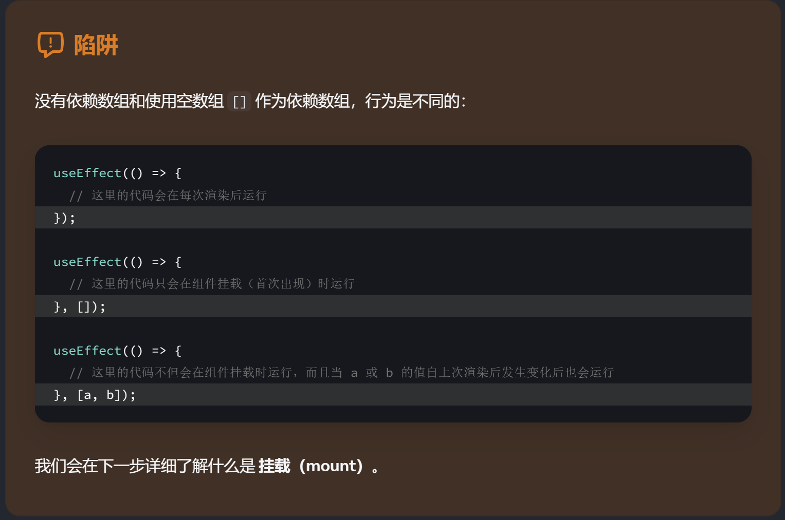

## ref
- 可以记住信息，但同时不会触发新的渲染
- 渲染过程中不能读取或写入ref.current
- 与state不同，ref是一个同步更新的量
- ref本身是一个普通的JavaScript对象

### ref操作DOM元素
错误示例：
```javascript
function VideoPlayer({ src, isPlaying }) {
  const ref = useRef(null);

  if (isPlaying) {
    ref.current.play();  // 渲染期间不能调用 `play()`。 
  } else {
    ref.current.pause(); // 同样，调用 `pause()` 也不行。
  }

  return <video ref={ref} src={src} loop playsInline />;
}
```
上述代码相当于在渲染期间调用play()和或pause()。逻辑上存在问题，在第一次渲染时，video还并未被渲染，if判断语句会造成null错误。


## useEffect
- Effect 允许你在渲染完成，提交结束后执行一些代码，以便将组件与 React 外部的某个系统相同步（如与服务器通信）。
- **Effect常用于由渲染本身，而不是按钮点击等事件引起的副作用**。默认执行（指不添加任何依赖项的时候）的时间在提交DOM页面更新之后。因此下述代码会产生死循环：
    ```javascript
    const [count, setCount] = useState(0);
    useEffect(() => {
    setCount(count + 1);
    });
    ```
- React 总是在执行下一轮渲染的 Effect 之前清理上一轮渲染的Effect（执行清理函数）
- 使用步骤
  + 声明
  + 指定依赖项
    useEffect中用到的判断变量都要添加到依赖项列表中，会根据依赖项列中的元素是否改变来确定是否重新运行effect中的函数。
    ```javascript
    useEffect(() => {
    // ...
    }, [])
    ```
  + 按需添加清理函数
    在开发环境中，React 会在组件首次挂载后立即重新挂载一次。添加清理函数可以在组件被卸载时候收尾，使得在重新挂载后能够正常运行。
    > 清理函数运行时机： <br>
        1. 每次Effect重新运行之前  <br>
        2. 组件卸载/被移除时最后一次调用清理函数
    ```javascript
    useEffect(() => {
    // ...
        return () => {};
    }, [])
    ```

- 不同的依赖项数组对应着不同的关系
  

> 从用户的角度来看它是 怎样的逻辑。如果这个逻辑是由某个特定的交互引起的，请将它保留在相应的事件处理函数中。如果是由用户在屏幕上 看到 组件时引起的，请将它保留在 Effect 中。

## useMemo
用于在渲染期间计算内容。减少计算的代价的支出。会在渲染期间执行，适用于纯函数场景。
> useEffect和useMemo对比 <br>
> 前者用于处理副作用。其函数在组件的渲染完成后运行，即在浏览器绘制屏幕之后执行。<br>
> 后者用于记忆计算结果。其函数在组件的渲染阶段运行，但前提是依赖数组中的值发生变化时才会重新计算。主要用于防止在不必要的渲染中进行计算，从而提高性能。