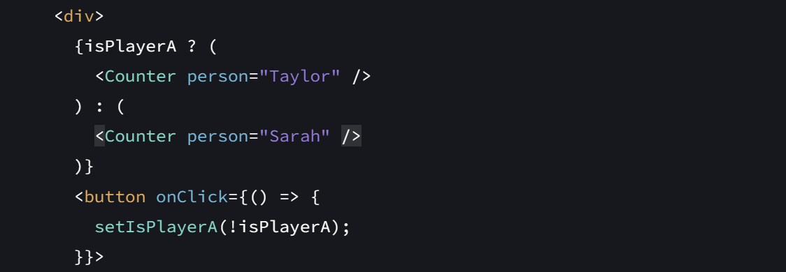
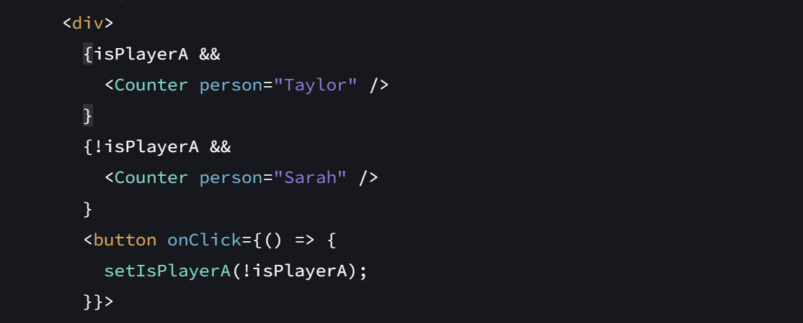
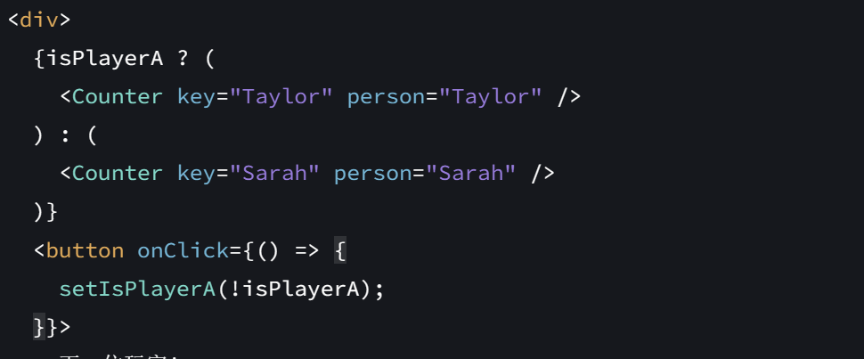

## 渲染和提交
- 触发
  + 应用启动时候初次渲染
  + 运行时组件（或其祖先之一）状态发生了改变。`set`函数即能够改变状态
- 渲染
  渲染过程中会递归渲染。递归渲染`return`中的组件
  + 初次渲染时，从根组件开始递归渲染
  + 运行时渲染，从状态发生改变的组件递归渲染
  > 可以看作是生成一个虚拟DOM的过程
- 提交：将渲染的更改提交到DOM
  + 初次渲染：将创建的所有DOM节点放在屏幕
  + 运行时渲染：react计算用最少的操作更新DOM使之与最新的渲染输出匹配
  > 更新DOM的方式并不是JSX中的组件（一个return对应的function为组件）为单位。**React 仅在渲染之间存在差异时才会更改不同的DOM节点**
### 一个问题？
[text](https://react.docschina.org/learn/render-and-commit#step-3-react-commits-changes-to-the-dom)
input组件的分类
- 受控的
  value属性如果由state或者props控制，那么会更新
- 非受控的


## state是一个快照
- 设置 state 不会立刻更改现有渲染中的变量，但会请求一次新的渲染。在事件处理函数执行完成后，便开始执行新的渲染。
### 事件处理函数中的setState函数执行
**会等到所有代其他码执行完毕后再执行state更新**。这意味着两件事：
- 即使在setState之后的代码，用到的也不是新值，而是旧值。
  ```
  onClick={()=>{
    A;
    setState();
    B;
  }
  ```
  实际上执行的顺序也是A B setState
- 事件处理函数在执行过程中不会被中断，在事件处理函数执行过程中不会触发重新渲染。同时也有利于提高渲染速度。类似批处理。
### 使用更新函数
在`setState`中使用更新函数`setNumber(n => n + 1);`(n与set对应的状态名不一定要一致)。但是setNumber**状态的更新还是在其他代码执行完毕后再执行的**
```javascript
import { useState } from 'react';

export default function Counter() {
  const [number, setNumber] = useState(0);

  return (
    <>
      <h1>{number}</h1>
      <button onClick={() => {
        alert("1 "+number)
        setNumber(n => n + 1);
        alert("2 "+number)
        setNumber(n => n + 1);
      }}>+3</button>
    </>
  )
}
```
上述代码输出1 0和2 0之后，{number}显示的number值为2。

### 问题描述
`t`和`tq`均是两个state。tq会随着输入及时变化。在按钮的onClick函数如下。需要注意的是，**`setQ()`**会异步的更新值。因此打印输出的依然是旧值，而不是新的值。在一些换页操作中，可以通过简单的加减操作来实现同步。但是在以下情况中需要使用其他方法。
```javascript
 const fetchData = () => {
    setQ(tq);
    console.log(q);
    console.log("use fetchData");
    setLoading(true);
    axios
      .get(base_api + q)
      ......
  };
```
### 解决
```javascript
// 假设你有一个方法来更新q的值
const updateQ = (newQ) => {
setQ(newQ);
};

useEffect(() => {
if (q) { // 确保q不为空时才发起请求
    setLoading(true);
    axios
    ......
}
}, [q]); // 监听q的变化
```
> 感觉上甚至有点像将`setQ`和请求的函数放在了不同的作用域。因此请求时的用到的值是更新之后的q值。


## useState的对象使用
当useState中使用数字、字符串时候，可以将其看作是一个不可变对象。
当useState中使用对象时候，虽然是可变对象，但也应该将其看作一个不可变对象。
换而言之，将**state看作是一个只读的**。对state的改变应该通过`useState`函数。如果直接用`state.attr`对作为某些事件响应函数的内容，可能不会触发一次重新渲染。

### 展开语法赋值对象
前文提及，useState中应该传入一个新的对象来更新。因此对于不需要改变的属性，可以通过展开语法直接复制。
`...`语法为浅拷贝，只复制一层，对于多层嵌套情况，需要多次使用。
```javascript
  function handleEmailChange(e) {
    setPerson({
      ...person,//赋值person的旧值
      email: e.target.value
    });
  }

```

## state中数组的使用
数组也是一个可变对象，不能简单的直接使用push等方法
- 添加元素：
  ```javascript
  setArtists( // 替换 state
    [ // 是通过传入一个新数组实现的
      ...artists, // 新数组包含原数组的所有元素
      { id: nextId++, name: name } // 并在末尾添加了一个新的元素
    ]
  );
  ```
- 在指定位置添加元素：
  使用`slice`以及类似python中`[]`拼接的操作
- 删除元素：
  fliter不会改变原始数组，而是创建一个新的数组
  ```
  let array = ['a', 'b', 'c', 'd', 'e'];
  let newArray = array.filter((element, index) => index % 2 === 0);
  console.log(newArray); // 输出: ['a', 'c', 'e']
  ```
  > 注意`===`和`==`有着区别，前者是严格相等（类型和数值都相等），后者会将二者变成相同的类型再进行比较。同理`!==`和`!=`类似。
- 转换数组
  创建一个新的数组，使用`map`
- 替换数组中的元素
  通过map来实现
  ```javascript
    function handleIncrementClick(index) {
    const nextCounters = counters.map((c, i) => {
      if (i === index) {
        // 递增被点击的计数器数值
        return c + 1;
      } else {
        // 其余部分不发生变化
        return c;
      }
    });
    setCounters(nextCounters);
  }
  ```
- 先拷贝数组，在对新数组进行操作，最后在setArray()
  比如reverse、sort方法等。这些方法会改变原数组。
  ```javascript
    function handleClick() {
    const nextList = [...list];//浅拷贝
    nextList.reverse();
    setList(nextList);
  }
  ```
  > 注意：对于一个存储对象的数组，使用的拷贝为浅拷贝。拷贝的新数组为newArr。但使用`newArr[0].attr`访问对象属性时，实际上也是直接在访问state本身。

## Immer
简化对于可变对象的useState时，可以使用`useImmer`

## state状态的保留
- 保留的情况：
  + 一个组件被渲染在UI树的相同位置（**位置是在DOM tree中的位置而不是在JSX文件中的位置**）
  + 相同位置的相同组件
- 不保留的情况:
  + 组件从 DOM 中移除时，它的state会被销毁。
  + 组件被移除
  + 一个不同的组件(接受不同key的组件也属于是不同的组件)被渲染在相同的位置

### 说明
1. 渲染在相同的位置的两个组件，组件内的state状态在切换时会保留。 

2. 渲染在不同位置的两个组件，组件内的state状态在切换时不会保留。存在从DOM删除和添加该组建的过程，也就必定意味着组件中的state不会被保留。

3. 虽然是渲染在相同位置，但由于`key`的设置，区分了不同组件的具体实现，使得state也相互独立。切换时state不会保留
