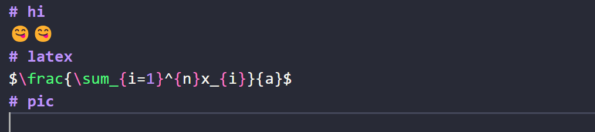

# hi
😋😋
# latex
$\frac{\sum_{i=1}^{n}x_{i}}{a}$
# pic

# github repo
::github{repo="HanFayeDD/WebBlog"}
# highlight
:::note[MY CUSTOM TITLE]
Highlights information that users should take into account, even when skimming.
:::